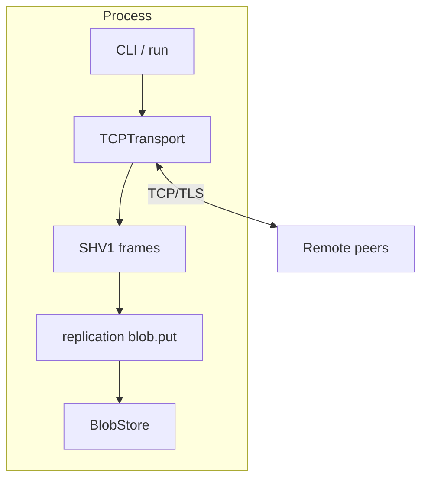

# StreamHive

[](https://github.com/AliSinaDevelo/StreamHive/actions/workflows/ci.yml)

StreamHive is a **Go library and CLI** for experimenting with distributed, content-addressed storage. It ships a production-minded **TCP transport** (context-aware listen/dial, TLS hooks, framing, metrics, limits), a **length-prefixed wire format** (`SHV1`), a typed **blob replication protocol**, memory and file-backed **blob stores**, and operational endpoints (`/livez`, `/readyz`, `/metrics`).

**Semver:** public API versions are tracked in [CHANGELOG.md](CHANGELOG.md) and [internal/version/version.go](internal/version/version.go) (currently **v0.2.0**, pre-1.0).

**Status:** networking, framing, local storage, and static-peer blob replication v0.3 are implemented. `storage.FileStore` provides durable local blobs for library users; the CLI replication demo still uses in-memory receiver storage. Conflict resolution and global discovery are not implemented. See [docs/ARCHITECTURE.md](docs/ARCHITECTURE.md).

## Prerequisites

- Go 1.22 or newer
- Optional: [golangci-lint](https://golangci-lint.run/) for `make lint`
- Optional: Docker for [docs/DEPLOYMENT.md](docs/DEPLOYMENT.md)

## Quickstart

```bash
go test ./...
go run . -version
make run
./bin/fs -listen :7070 -dial 127.0.0.1:8080
./bin/fs -listen 127.0.0.1:0 -health 127.0.0.1:8080   # HTTP live/ready/metrics
```

### Two-node replication demo

Terminal 1: start a receiver with framed replication and metrics.

```bash
go run . -listen 127.0.0.1:7070 -replicate -health 127.0.0.1:8080
```

Terminal 2: dial the receiver and send one blob.

```bash
go run . -listen 127.0.0.1:0 -dial 127.0.0.1:7070 -put-key demo -put-data "hello streamhive" -exit-after-put
```

Inspect counters:

```bash
curl -s http://127.0.0.1:8080/metrics
```

Look for `replication_blobs_stored`, `replication_bytes_stored`, and transport frame counters. The receiver stores blobs in memory for this v0.3 path.

Or run the whole flow:

```bash
make demo-replication
```

For a longer-lived node with static peers, use `-peers` and reconnect backoff:

```bash
go run . -listen 127.0.0.1:7071 -peers 127.0.0.1:7070,127.0.0.1:7072 -peer-reconnect
```

`-peer-reconnect` retries only `-peers` targets. `-dial` stays a one-shot connection attempt for scripts and tests.

### Library packages

| Import | Purpose |
|--------|---------|
| `github.com/AliSinaDevelo/StreamHive/p2p` | `TCPTransport`, framing (`ReadFrame` / `WriteFrame`), metrics |
| `github.com/AliSinaDevelo/StreamHive/replication` | Blob replication messages (`blob.put`) and store apply helper |
| `github.com/AliSinaDevelo/StreamHive/storage` | `BlobStore`, `MemoryStore`, `FileStore` |

Wire handshake string constant: `p2p.HandshakeVersionV1` (carry inside application frames).

## CLI flags (stable surface)

| Flag | Meaning |
|------|---------|
| `-listen` | TCP listen address |
| `-dial` | Optional peer to dial after listen |
| `-peers` | Optional comma-separated peers to dial after listen |
| `-peer-reconnect` | Retry `-peers` with exponential backoff |
| `-peer-reconnect-min` / `-peer-reconnect-max` | Reconnect backoff bounds |
| `-health` | HTTP `host:port` for `/livez`, `/readyz`, `/metrics` |
| `-max-peers` | Cap simultaneous peers (0 = unlimited) |
| `-dial-timeout` | Outbound dial timeout |
| `-read-idle-timeout` | Peer read deadline refresh |
| `-tls-cert` / `-tls-key` | Server TLS |
| `-tls-ca` / `-tls-server-name` / `-tls-insecure-skip-verify` | Client TLS |
| `-replicate` | Enable in-memory blob replication from framed peers |
| `-put-key` / `-put-data` | Send one blob to the `-dial` peer |
| `-exit-after-put` | Exit after the outbound blob frame is written |
| `-max-blob-bytes` | Cap replicated blob payload size |

See the [Makefile](Makefile) for `test-race`, `vet`, `cover`, and `lint`.

## Architecture (summary)



## Operations & supply chain

- CI pins third-party GitHub Actions to immutable commit SHAs and uploads **coverage** plus a **CycloneDX SBOM** (`sbom` job).
- [docs/WORKFLOWS.md](docs/WORKFLOWS.md) — local and CI expectations.
- [docs/GOVERNANCE.md](docs/GOVERNANCE.md) — branch protection and release hygiene.
- [docs/DEPLOYMENT.md](docs/DEPLOYMENT.md) — Docker and Kubernetes sketch.

## Contributing

See [CONTRIBUTING.md](CONTRIBUTING.md). Security: [SECURITY.md](SECURITY.md).

## License

MIT — see [LICENSE](LICENSE).
