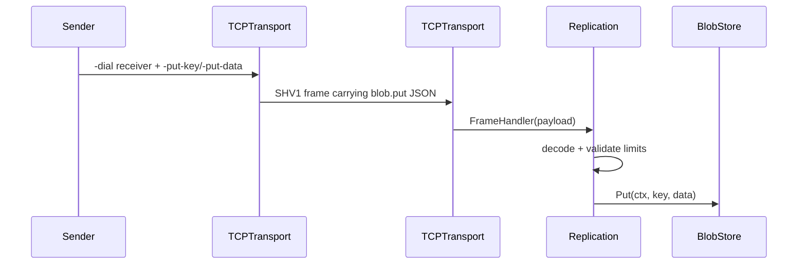

# Architecture

## Layers

1. **Transport (`p2p`)** — `TCPTransport` with `context.Context` on `ListenAndAccept` / `Dial`, accept-loop shutdown coordinated with `Close`, optional TLS, optional framed reads via `FrameHandler`, metrics, and peer disconnect hooks.
2. **Framing (`p2p`)** — `SHV1` length-prefixed payloads (`ReadFrame` / `WriteFrame`) with a configurable maximum size (DoS bound). Application-level handshake string: `HandshakeVersionV1`.
3. **Replication (`replication`)** — typed JSON messages carried inside frames. The first supported message is `blob.put`, which writes one key/value blob to a receiving `BlobStore`.
4. **Storage (`storage`)** — `BlobStore` interface with `MemoryStore` for tests and demos; content addressing can layer hashes as opaque keys.

## Package map

| Path | Role |
|------|------|
| `p2p` | `Peer`, `Transport`, `TCPTransport`, `TCPPeer`, wire framing |
| `replication` | Blob replication protocol, validation limits, apply helper |
| `storage` | `BlobStore`, `MemoryStore` |
| `internal/version` | Semver string for releases |
| `.` | CLI: `run`, health HTTP server, replication demo flags |

## Concurrency and lifecycle

- Listener and peer map share a mutex; the accept loop exits when the listener is closed.
- `Close` stops new accepts, waits for the accept goroutine, then closes open peer connections. Peer goroutines remove themselves from the map on EOF / error via `unregisterPeer`.
- Optional `FrameHandler` runs per frame on each peer session until error, context cancellation, or disconnect.
- CLI replication installs a `FrameHandler` that decodes `blob.put` messages and writes to an in-memory `MemoryStore`. Outbound `-put-key` / `-put-data` sends one frame after `-dial` connects.

## Failure modes (transport)

- **Dial** respects context cancellation and optional `DialTimeout`.
- **Max peers** rejects new inbound connections when the cap is reached (`PeersRejected` metric).
- **TLS** failures surface from `HandshakeContext` on outbound dials. **mTLS** is supported by configuring `tls.Config` yourself (`ClientAuth`, `ClientCAs` on `TLSServerConfig`; client certs on `TLSClientConfig`). There is no application-level identity beyond TLS yet.
- **Replication decode/apply** rejects unknown message types, empty keys, oversized keys, and oversized payloads before writing to storage.

## Replication v0.3 scope

Implemented:

- Static peer replication over `-dial`.
- One message type: `blob.put`.
- Receiver-side in-memory storage via `storage.MemoryStore`.
- JSON `/metrics` counters for stored/sent blobs, bytes, and replication errors.

Not implemented yet:

- Durable blob storage.
- Anti-entropy, retries, or conflict resolution.
- Peer discovery beyond static dial targets.
- Authenticated application-level identity beyond optional TLS/mTLS configuration.

## Roadmap

- Merkle or hash-linked chunk references on top of `BlobStore`
- Durable blob storage behind `BlobStore`
- Replication and discovery beyond one-shot static `-dial`
- Authenticated application protocol on top of `FrameHandler`
