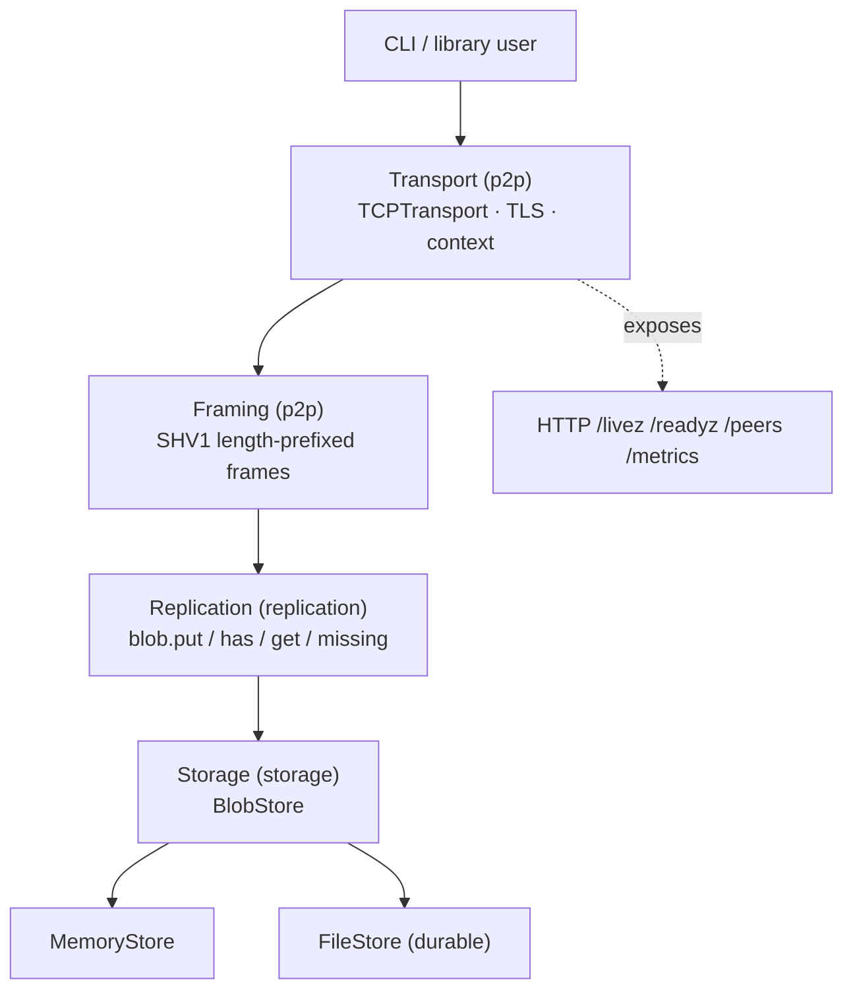
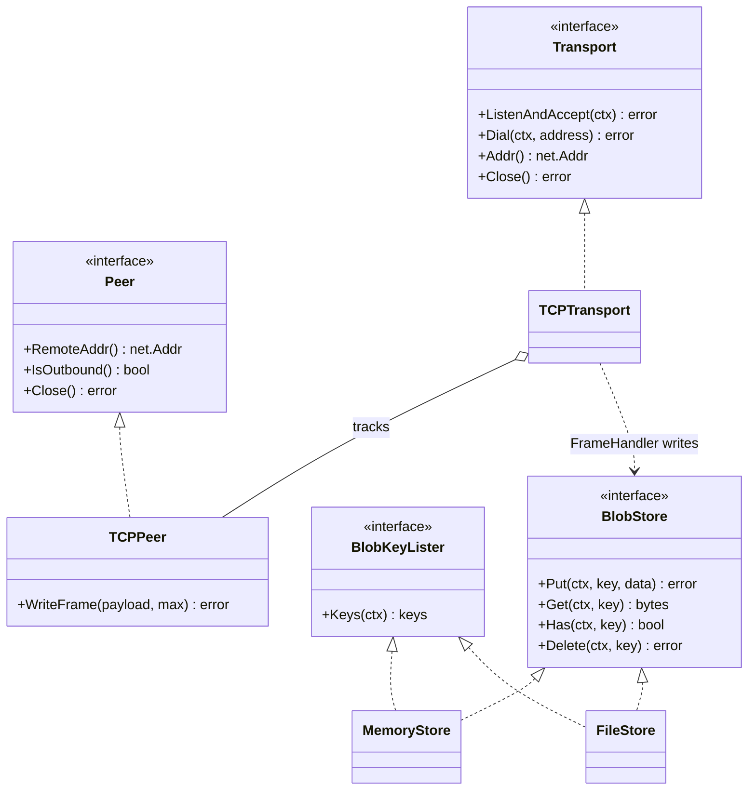
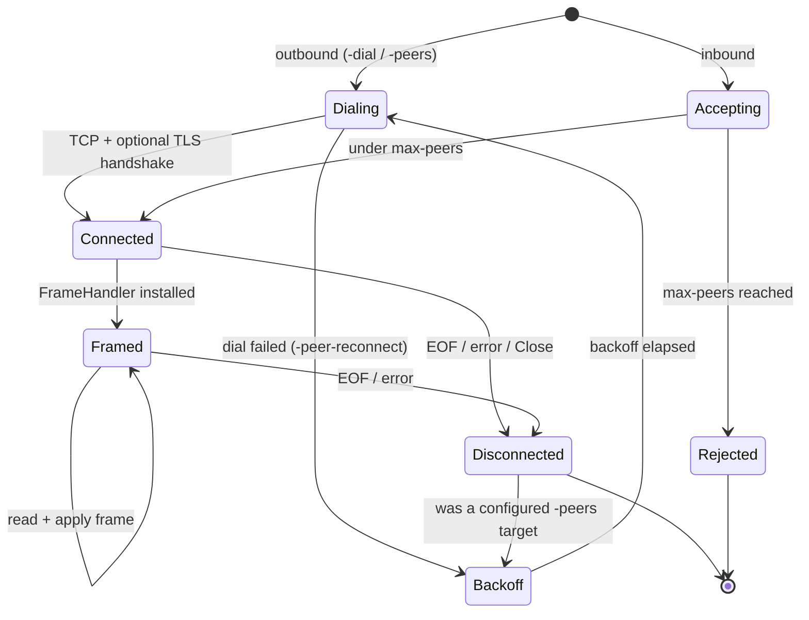
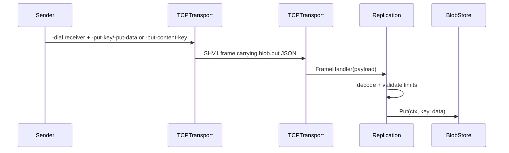

# Architecture

StreamHive is built in four layers — transport, framing, replication, and storage — each
a thin seam over the one below it. The diagram below is the fastest orientation; the
sections after it go deep.

## Layers

1. **Transport (`p2p`)** — `TCPTransport` with `context.Context` on `ListenAndAccept` / `Dial`, accept-loop shutdown coordinated with `Close`, optional TLS, optional framed reads via `FrameHandler`, metrics, and peer disconnect hooks.
2. **Framing (`p2p`)** — `SHV1` length-prefixed payloads (`ReadFrame` / `WriteFrame`) with a configurable maximum size (DoS bound). Application-level handshake string: `HandshakeVersionV1`.
3. **Replication (`replication`)** — typed JSON messages carried inside frames. `blob.put` writes one key/value blob to a receiving `BlobStore`; `blob.has`, `blob.get`, and `blob.missing` provide the inventory/request vocabulary for anti-entropy sync.
4. **Storage (`storage`)** — `BlobStore` interface with `BlobKeyLister` inventory support, `MemoryStore` for tests/demos, and `FileStore` for durable local blobs; SHA-256 helpers provide stable content-addressed keys.

## Package map

| Path | Role |
|------|------|
| `p2p` | `Peer`, `Transport`, `TCPTransport`, `TCPPeer`, wire framing |
| `replication` | Blob replication protocol, validation limits, apply helper |
| `storage` | `BlobStore`, `MemoryStore` |
| `internal/version` | Semver string for releases |
| `.` | CLI: `run`, health HTTP server, replication demo flags |

### Core interfaces

The seams are interfaces, so storage and peers are swappable without touching the layers
above. `TCPPeer` adds `WriteFrame` on top of the `Peer` contract.

## Concurrency and lifecycle

- Listener and peer map share a mutex; the accept loop exits when the listener is closed.
- `Close` stops new accepts, waits for the accept goroutine, then closes open peer connections. Peer goroutines remove themselves from the map on EOF / error via `unregisterPeer`.
- Optional `FrameHandler` runs per frame on each peer session until error, context cancellation, or disconnect.
- CLI replication installs a `FrameHandler` that decodes `blob.put` messages and writes to `MemoryStore` by default, or `FileStore` when `-store-dir` is set. Outbound `-put-key` / `-put-data` sends one manually keyed frame after `-dial` or `-peers` connects; `-put-content-key` derives the key from `SHA-256(-put-data)`. `-list-keys` inspects durable stores by printing known keys as hex.
- Receivers treat 32-byte keys as SHA-256 content addresses and verify payload integrity before storage. Exact duplicate key/data writes are skipped and counted separately; opaque keys with different data still replace existing values.
- `-peer-reconnect` manages only static `-peers` targets. It retries failed dials with exponential backoff and schedules another retry when an outbound configured peer disconnects.
- Replication peers advertise local keys on connect. When `-sync-interval` is set, nodes also advertise local keys periodically to repair blobs added after peer startup. Receivers reply with `blob.missing`, and owners send the requested blobs with `blob.put`.

### Peer lifecycle

## Failure modes (transport)

- **Dial** respects context cancellation and optional `DialTimeout`.
- **Max peers** rejects new inbound connections when the cap is reached (`PeersRejected` metric).
- **TLS** failures surface from `HandshakeContext` on outbound dials. **mTLS** is supported by configuring `tls.Config` yourself (`ClientAuth`, `ClientCAs` on `TLSServerConfig`; client certs on `TLSClientConfig`). There is no application-level identity beyond TLS yet.
- **Replication decode/apply** rejects unknown message types, empty keys, oversized keys, and oversized payloads before writing to storage.

## Replication v0.3 scope

Implemented:

- Static peer replication over `-dial` and comma-separated `-peers`.
- Optional reconnect/backoff for `-peers`.
- Message types: `blob.put`, `blob.has`, `blob.get`, and `blob.missing`.
- Startup anti-entropy for connected `-replicate` peers.
- Receiver-side storage via `storage.MemoryStore` or durable `storage.FileStore` with `-store-dir`.
- JSON `/peers` snapshots for connected peer addresses/direction.
- JSON `/metrics` counters for stored/sent blobs, bytes, duplicates, and replication errors.

Not implemented yet:

- Retries for partial sync failures or conflict resolution.
- Automated peer discovery beyond static dial targets.
- Authenticated application-level identity beyond optional TLS/mTLS configuration.

## Storage choices

Use `MemoryStore` for tests, examples, and short-lived CLI demos. It copies values on `Put`/`Get`, is safe for concurrent access, and loses data when the process exits. CLI replication uses this by default.

Use `FileStore` when blobs must survive process restarts. Keys are hex-encoded into file names, writes use a temporary file followed by `rename`, and missing keys map to `storage.ErrNotFound`. CLI replication uses this when `-store-dir` is set. It is intentionally simple local storage, not a distributed database.

Use `storage.SHA256Key` or `storage.SHA256KeyHex` when the key should be derived from blob content instead of caller-chosen metadata.

## Roadmap

- Hash-linked chunk references on top of `BlobStore`
- Automated discovery beyond static peers
- Authenticated application protocol on top of `FrameHandler`
